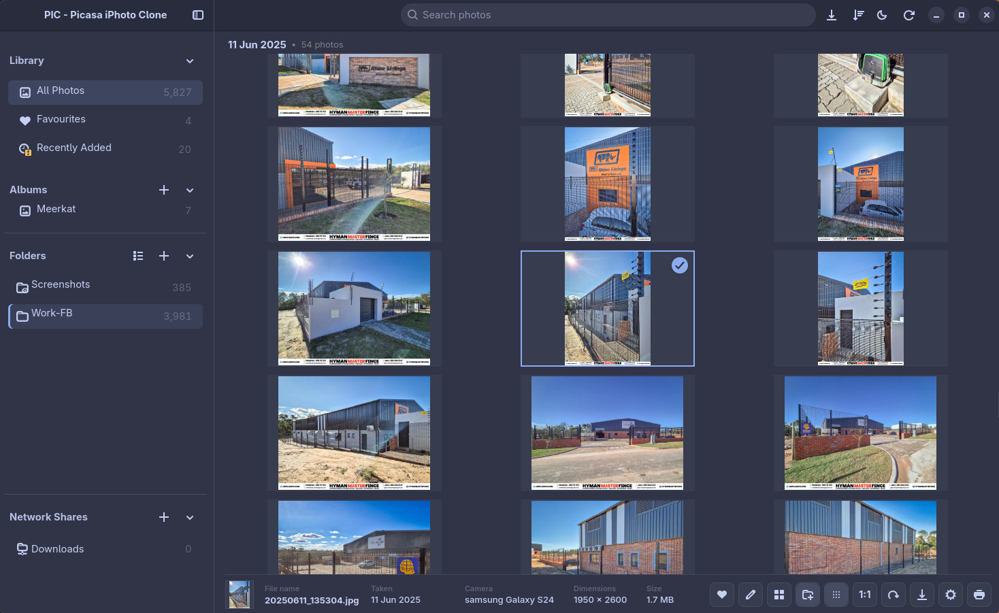
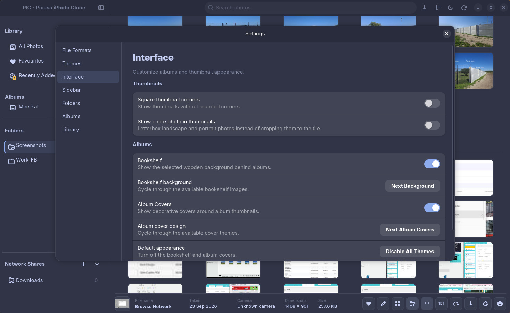
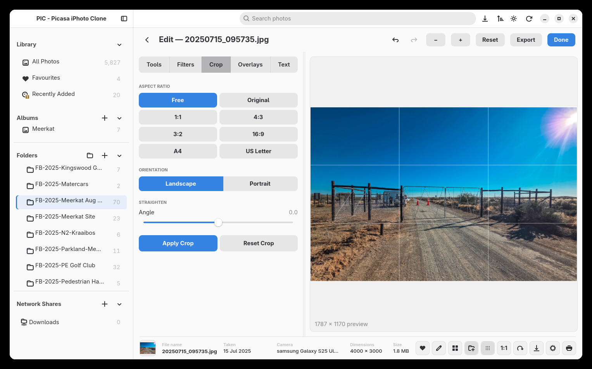

# PIC: Picasa iPhoto Clone — Release Candidate 2

**This is a massive upgrade for PIC: Picasa iPhoto Clone.** Since Release Candidate 1, PIC has grown into a much more complete photo workspace: browse photos across your network, create and resume collages, print with control over the page, and make richer edits—all wrapped in a refreshed, themeable interface.

The familiar promise is still here: your photos stay yours. PIC works with your folders and keeps your original images safe.

## What’s new since RC1

### Browse photos on your network/shared drives (Linux Only)

If network browsing does not work, manually mount your SMB or NFS share to a local directory, either temporarily or permanently using `/etc/fstab`. Then add the mounted folder to your photo library.

PIC can now find and browse shared folders on your local network, including SMB and NFS shares. Add a share from the in-app browser, move through its folders, and let PIC reconnect registered shares when you start the app. Network photos can be browsed alongside your regular library.

### Make more with Collage

Build Grid, Mosaic, or Smart Mosaic collages, adjust the layout and appearance, and export a high-resolution result. Collage work can be saved and resumed, with undo and redo to help you explore different arrangements. You can also open a photo for editing and return to your collage.

### More ways to edit

Edit Mode now includes image overlays and text, with controls for placement, size, rotation, and styling. The expanded editing tools remain non-destructive, so your original photo is preserved. Filter previews and editing interactions have also been refined to feel smoother and clearer.

### Print with control

Prepare one or many photos for printing. Choose page and photo sizes, paper orientation, fit or crop, and how many photos appear on each page. A live preview helps you see the layout before printing.

### A refreshed look, your way

PIC now discovers themes from theme folders, making it easier to explore different appearances and create community themes. The theme collection has grown, settings have been reorganized, and sidebar controls have been reworked for smoother browsing and easier customization.

### A more comfortable everyday experience

- Faster, steadier browsing and search in large libraries.
- Smoother photo viewing, zooming, and keyboard navigation.
- More reliable folder watching and thumbnail handling.
- Clearer progress feedback for large export and photo operations.
- Easier export from the viewer, editor, and photo menus.
- Continued improvements to Linux and Windows build workflows.

## Thanks for trying PIC

RC2 brings together a huge amount of work across browsing, editing, creating, printing, and everyday polish. We hope it makes spending time with your photo collection feel even better.

PIC: Picasa iPhoto Clone is an independent project inspired by classic Picasa and iPhoto. It is not affiliated with Google or Apple.
