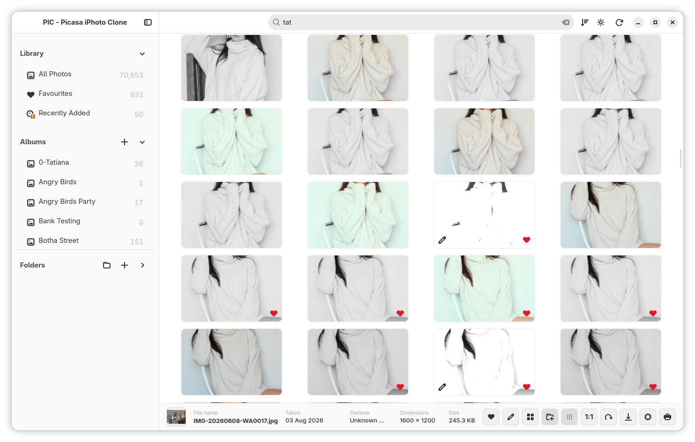

# PIC Guide 3 — The Library: Photos, Favourites, Albums & Search

*Part of the [PIC release candidate guides](README.release.candidate.md).*

The Library is the heart of PIC — the place where all your photos come together. This guide covers the Library views, organising with Favourites and Albums, and finding any photo fast.

---

## The Three Library Views

At the top of the sidebar you'll find three smart views:

- **Photos / All Photos** — your entire collection in one grid. Mine shows over 70,000 photos and it's still fast.
- **Favourites** — every photo you've ever hearted, together in one place.
- **Recently Added** — the newest imports, perfect after plugging in a memory card.

Each view shows a **live count**, so you always know the size of your collection.

## The Thumbnail Grid

Photos appear as rounded thumbnails in a smooth-scrolling grid. Little touches you'll notice:

- A **selected photo** gets a clear highlight with a check mark.
- **Favourites** show a small red heart on the corner.
- Photos that have been edited show a small **pencil badge**.
- The grid stays smooth even with tens of thousands of photos.

## Zoom the Thumbnails In and Out

Hold **Ctrl** and scroll your **mouse wheel** to make thumbnails bigger…

…or smaller. Zoomed in, you can almost enjoy each photo on its own. Zoomed out, you can scan hundreds at once. There's also a thumbnail-size button in the info bar at the bottom.

## Grouping and Sorting

From the top bar you can:

- **Group** photos by **Day** or **Month** — the grid shows neat section headings like *"May 2026 · 85 photos"* — or turn grouping off.
- **Sort** by date taken, name, file size, dimensions or date added — ascending or descending.

## Favourites — One Heart, Zero Effort

Select a photo (or several) and click the **❤️** in the info bar — or use the right-click menu. That's it. Hearted photos get a heart badge and appear in the **Favourites** view, and you can flip through your favourites in the viewer just like any other collection.

## Albums — Your Collections

Create an album with the **+** next to *Albums*, give it a name, and start filling it:

1. Select one photo — or Ctrl+click several.
2. Right-click and choose **Add to album** (or use the photo menu).
3. The photo now also lives in that album — no copies made.

Here the *Mercedes* album is selected and shows its photos. One photo is selected, ready for an action. Removing a photo from an album never touches the original file in its folder.

## Search — Find Anything Instantly

Click the search bar and just type. Results filter as you type, matching:

- **Photo file names**
- **Folder names** — with handy suggestions showing the matching folders and their locations

Searching *2025* above instantly suggests all the 2025 folders, while the grid fills with matching photos. No tags to maintain, no cataloguing chore — it just finds things.

## From Grid to Viewer

- **Single click** selects a photo and shows its details in the bottom info bar.
- **Double-click** (or press Enter / Space) opens it in the big photo viewer.
- Navigate with **arrow keys** or the **mouse wheel**, zoom with **Ctrl + wheel**, press `Esc` to come back to the grid exactly where you left off.

Multiple selection works here too: Ctrl+click several photos, then favourite, album or collage them in one go.

---

**Previous guide:** [← Folders](README.folders.md) · **Next guide:** [Edit Mode →](README.edit-mode.md)
