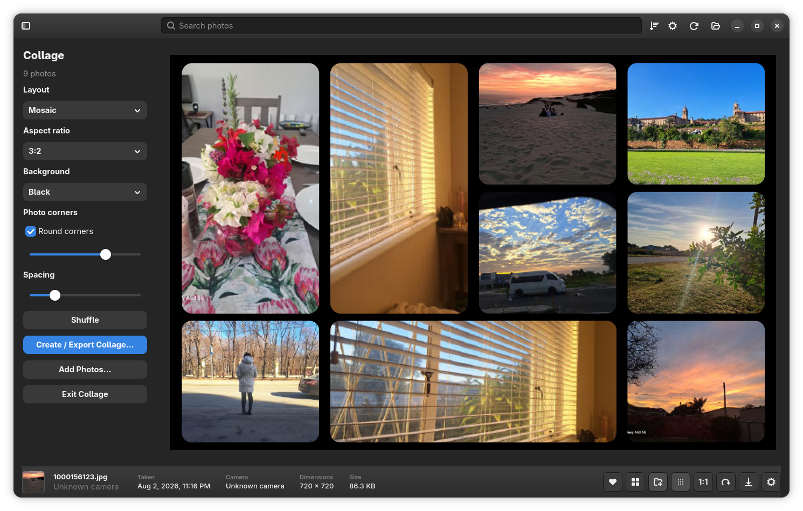

# PIC — Picasa iPhoto Clone

### A fast, local photo manager for Linux inspired by the simplicity of Picasa and classic iPhoto.

**PIC** is for people who want to open their photo library and simply **browse, organise, view, edit and create** — without turning photo management into a complicated workflow.

Picasa disappeared. Classic iPhoto changed into something very different. On Linux, I wanted the same feeling again: a photo manager that is visual, quick to navigate, works with folders you already have, and stays out of your way.

That is why I started **PIC — Picasa iPhoto Clone**.

PIC is **Linux-first**, local, lightweight and under active development. It is not trying to replace a professional RAW editor such as Lightroom or darktable. The goal is different: make managing a large personal photo collection enjoyable again.

> **Your photos stay your photos.** PIC works with your existing folders and builds its own local library and thumbnail cache for fast browsing.

---

## Main Library


PIC gives you a clean photo-first library with quick access to **All Photos, Favourites, Recently Added, Albums and your imported folders**.

The interface is intentionally simple. Select a photo and the important information and actions are available immediately without covering the photo grid with toolbars and panels.

---

## Photo Editing


PIC now includes an **Edit Mode** so everyday photo adjustments can be done without leaving the photo library.

The editing workflow is designed around the same idea as the rest of PIC: keep it quick and understandable. You can work on a photo, move to another image, copy useful edits between photos, and reset changes when you want to start again.

Editing is integrated into the normal photo workflow instead of feeling like a separate application.

---

## Collage Creator



PIC also includes a built-in **Collage Creator**.

Select multiple photos and create a collage directly from your library. Different layouts are available for clean grids, mosaics and more playful picture arrangements, with controls for the overall shape, spacing and background.

Collages can be shuffled until you find an arrangement you like and then exported as a high-resolution image.

---

# What PIC Can Do

## Browse your photo collection

- Import existing photo folders
- Browse thousands of photos in a fast thumbnail grid
- Resize thumbnails to suit the way you work
- Open photos in a clean full-window viewer
- Move quickly between photos with the keyboard or mouse wheel
- View photos at **1:1 / 100%**
- Zoom in and out incrementally
- Pan around large photos while viewing at full size
- Rotate photos
- See photo date, camera, dimensions and file size at a glance

## Organise without changing your folder structure

- **All Photos** library view
- **Favourites**
- **Recently Added**
- Create your own **Albums**
- Add one or multiple photos to an album
- Remove photos from albums without deleting the original photo
- Browse your original folders directly from the sidebar
- Search across the photo library
- Sort photos by date, name, file size, dimensions or date added

Albums are virtual collections, so the same photo can appear in different albums without creating extra copies of the original file.

## Edit photos inside PIC

- Dedicated **Edit Mode**
- Apply everyday photo adjustments without opening another application
- Copy edits from one photo and paste them onto another
- Reset edits when you want to return to the original look
- Keep editing integrated with normal browsing and photo selection

PIC's editing tools are aimed at the kind of quick changes many people used Picasa for — not at replacing a full professional RAW development suite.

## Create photo collages

- Select several photos from the library
- Create a collage directly from the selected images
- **Grid** layouts
- **Mosaic** layouts
- **Picture Pile** style layouts
- Shuffle arrangements
- Change collage aspect/orientation
- Adjust spacing and background
- Export the finished collage as a high-resolution image

## Fast photo viewing

The photo viewer has received a lot of attention because opening and moving through photos should feel immediate.

- Fast cached preview when a photo opens
- Higher-quality image loads automatically for viewing
- Previous / next navigation with arrow keys
- Mouse-wheel photo navigation
- `Ctrl + mouse wheel` zooming
- Incremental keyboard zoom
- Fit-to-window view
- True **1:1** viewing
- Click-and-drag panning at 1:1
- Double-click to close the viewer
- Click outside the photo to close
- Right-click photo actions available from the viewer

## Designed for real photo libraries

PIC is built around normal folders on your computer, external drives and other storage locations.

If a drive or folder is disconnected, PIC does not simply forget the library. Cached thumbnails can remain visible and the app marks the original as **unavailable/offline** so you know exactly what happened.

When the storage becomes available again, PIC can reconnect with the originals.

This is especially useful for photographers who keep older collections on external disks, removable storage or network locations.

## Import without locking up the library

Adding a folder does not mean you should have to stare at a frozen application.

PIC can add photos to the library while thumbnail work continues separately, allowing the collection to become usable progressively instead of waiting for every preview to finish first.

Existing unchanged photos are not needlessly rebuilt every time a folder is refreshed.

---

# Image Format Support

PIC is intended for mixed photo libraries, not only JPEG folders.

### Standard image formats

**JPEG, PNG, WebP, GIF, BMP, TIFF, AVIF, HEIC and HEIF**

### RAW formats

**NEF, NRW, CR2, CR3, ARW, DNG, RAF, ORF, RW2, PEF, SRW and RAW**

Where possible, PIC uses the preview already stored inside RAW files so thumbnails and normal viewing do not have to process the full camera sensor image every time.

HEIC/HEIF photos are also supported, which is useful for libraries containing photos from modern phones and Apple devices.

You can choose which image formats are visible from PIC's settings.

---

# Keyboard & Mouse Shortcuts

## Photo viewer

| Shortcut | Action |
| --- | --- |
| `←` / `→` | Previous / next photo |
| Mouse wheel | Previous / next photo |
| `Space` | Toggle 1:1 view |
| `+` / `=` | Zoom in |
| `-` | Zoom out |
| `Ctrl + mouse wheel` | Zoom in / out |
| `0` | Fit photo to window |
| `1` | View at 100% |
| Drag mouse | Pan when viewing at 1:1 |
| Double-click | Close photo viewer |
| `Esc` | Close photo viewer |

## Photo grid

- Use the **arrow keys** to move through photos.
- Use **Ctrl + mouse wheel** to quickly make thumbnails larger or smaller.
- Multiple photos can be selected for actions such as adding them to an album or creating a collage.

---

# A Different Kind of Linux Photo App

There are excellent professional photo tools on Linux, but that is not what PIC is trying to be.

PIC is for the person who remembers opening **Picasa** or the older versions of **iPhoto** and immediately seeing their pictures — no complicated catalog workflow, no wall of editing controls and no need to learn a professional photography application just to enjoy a photo collection.

The goal is simple:

**Open PIC. Find your photos. Enjoy them. Organise them. Make a few edits. Create something.**

That combination is what I have been looking for on Linux, so I decided to build it.

---

# Appearance

PIC currently includes different interface styles, including its darker photo-focused presentation and a more standard GTK appearance.

The sidebar can be hidden when you want more room for photos, and the layout adapts as the window size changes.

Light and dark desktop appearance is supported where appropriate.

---

# Local First

PIC is designed around a **local photo library**.

Your photo information, albums, favourites and application settings are stored locally. Thumbnail previews are cached locally so returning to an existing library is much faster than rebuilding every image from scratch.

Your original photo folders remain the source of the library.

---

# Linux First

PIC was started because I wanted this kind of photo application on **Linux**, and Linux remains the main target.

I have also experimented with a Windows build, but Windows support is still secondary and should currently be considered a work in progress.

---

# Running PIC from Source

```bash
cargo run --release
```

You will need the Rust toolchain together with the GTK4 and libadwaita development libraries required by the application.

Packaged releases and easier installation are still part of the ongoing work.

---

# Project Status

PIC is under **very active development**.

A lot has changed in a short time: the photo viewer, albums, large-library browsing, RAW handling, HEIC/HEIF support, offline-library handling, search and sorting, Edit Mode, right-click photo actions, photo adjustments and the Collage Creator have all grown substantially.

Because development is moving quickly, some features and interface details may still change and bugs should be expected.

Testing, ideas, bug reports and contributions are welcome.

---

# Why I Built It

I am not trying to build the biggest photo application.

I wanted the **fastest and simplest photo application I would actually enjoy using every day**.

Picasa and classic iPhoto understood something important: the photos were the main event. The application was there to help you see them, find them and enjoy them.

PIC is my attempt to bring that idea back to a modern Linux desktop while adding the things I want today — large-library support, modern photo formats, RAW previews, offline storage awareness, quick editing and a built-in collage creator.

---

# Disclaimer

PIC is an independent open-source project inspired by classic desktop photo-management applications. It is **not affiliated with, sponsored by or endorsed by Google or Apple**.

I have not lost photos while building or testing PIC, but the application is still under active development.

For now, please test PIC with photos that are backed up, copies of your collection, or a temporary test folder first. Your important originals should always have a proper backup regardless of which photo-management application you use.

---

## PIC — Picasa iPhoto Clone

**Fast photo browsing. Simple organisation. Practical editing. Collages. Your folders. Your photos. Linux.**
