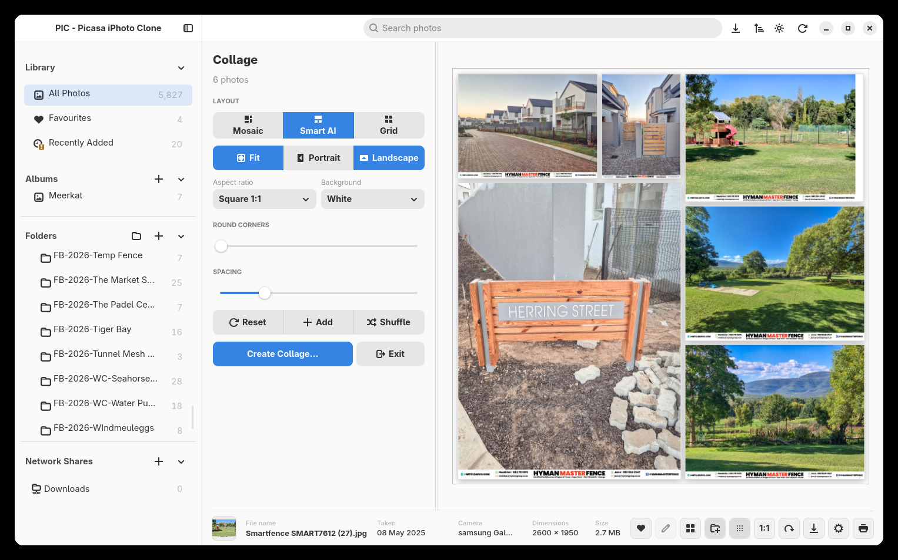
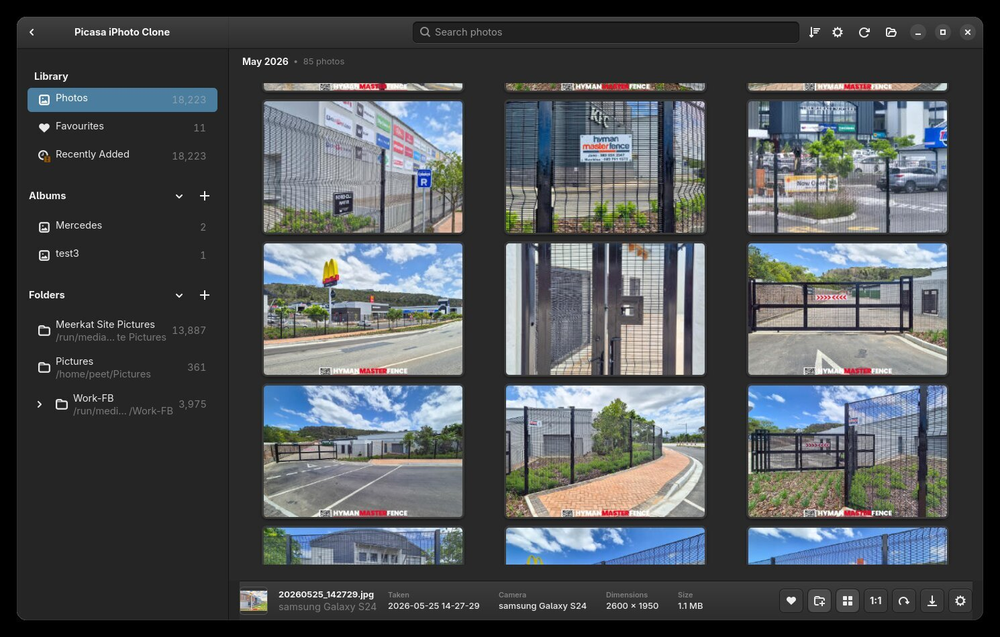
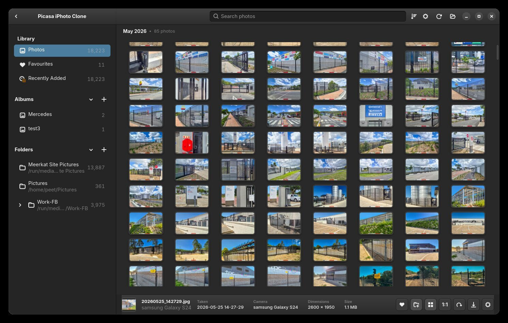
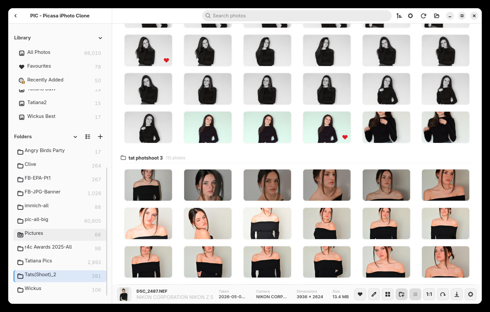
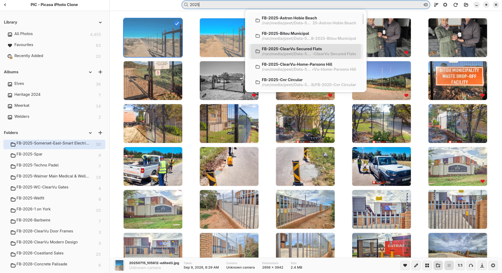
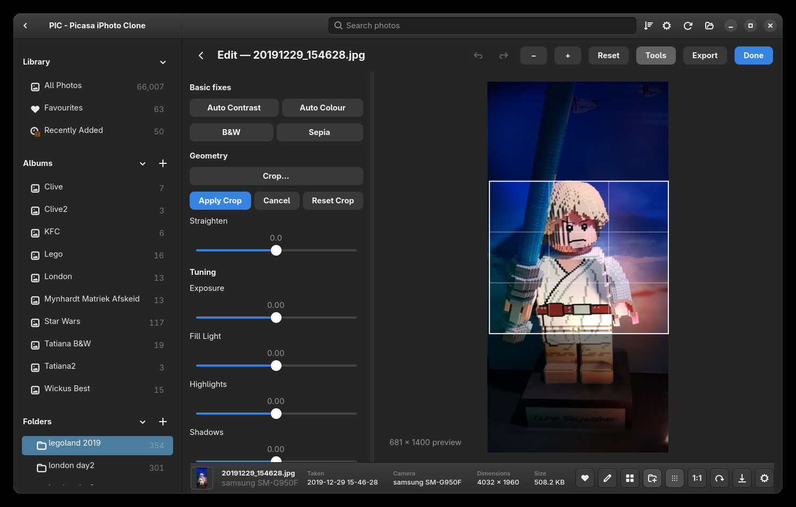
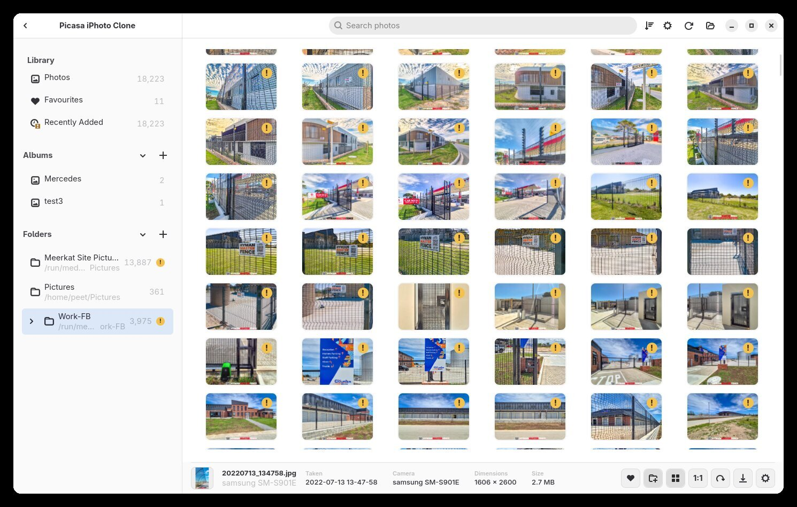
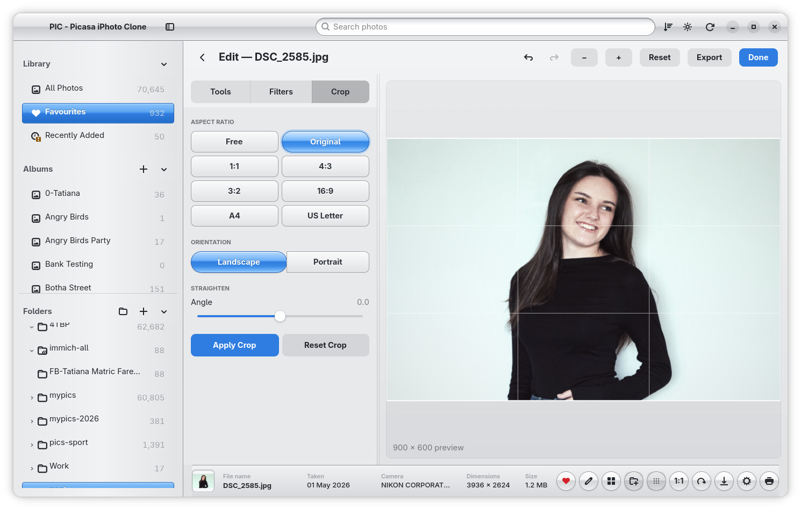
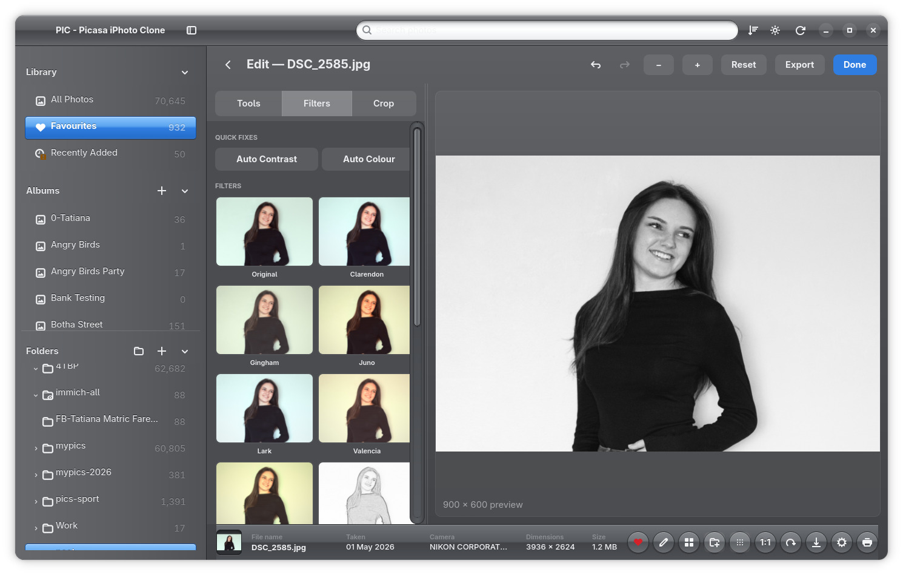
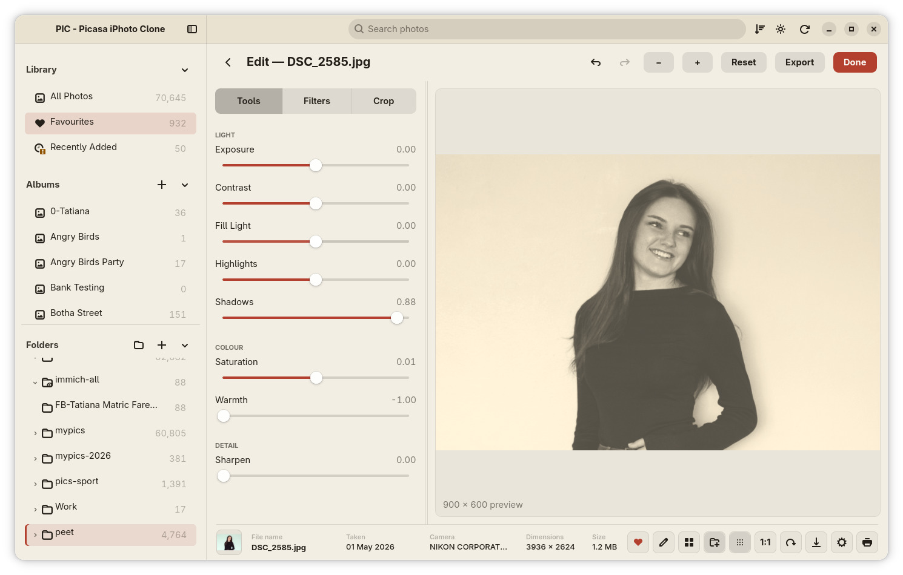

# PIC — Personal Image Catalogue

*Inspired by Picasa and iPhoto*

### The simple, fast photo manager for Linux. Your folders. Your photos. No fuss.

---

## New in Release Candidate 2

**PIC — Personal Image Catalogue has grown into a much more capable photo workspace.** RC2 adds network share browsing, richer editing, resumable collages and flexible photo printing, alongside a refreshed interface and smoother everyday use.

### Browse network shares

Find and browse SMB and NFS shared folders on your local network from inside PIC. Navigate share folders and reconnect registered shares when you launch the app.


### Add text and image overlays to edits

Place text or image overlays on a photo and adjust their position, size, rotation and style. Editing remains non-destructive, so your original stays safe.


### Save your collage work and print your photos

Save and resume collage projects, explore layouts with undo and redo, then export a high-resolution collage. Print one or many photos with control over page size, orientation, fit or crop, and the number of photos on each page.



Themes, settings, sidebar controls, photo navigation and operation progress have also been improved. See the full [Release Candidate 2 notes](README.ReleaseCandidate2.md) for more.

---

## What is PIC?

PIC is a photo manager for people who just want to **see their photos**.

If you remember **Picasa** or the classic **iPhoto**, you remember the feeling: you opened the app and your pictures were simply *there*. Big, colourful, easy to browse. No accounts, no uploads, no complicated workflow. PIC brings that feeling back — modernised for today's Linux desktop.

PIC is **local-first**. It reads the photo folders you already have on your computer or external drives and builds a fast, private library around them. Your original photos are never touched, never moved and never uploaded anywhere.

Open PIC. See your photos. That's the idea.

---

## The Main Window


Everything happens in one friendly window:

- **Sidebar (left)** — jump between your Library, Albums and Folders.
- **Search bar (top)** — find any photo instantly.
- **Photo grid (centre)** — all your photos as thumbnails, ready to scroll.
- **Info bar (bottom)** — shows everything about the selected photo, with one-click action buttons.

That's the whole app. No hidden menus, no modes to learn.

---

## What Can You Do with PIC?

### Browse your whole collection in one place


Point PIC at your photo folders and it shows everything in one big, scrolling grid. PIC is built to handle **very large libraries** — tens of thousands of photos — and stays fast. Thumbnails are cached, so the second time you open your library it flies.

### Make thumbnails bigger or smaller on the fly



Zoom in for big, beautiful thumbnails… 



…or zoom out to see hundreds of photos at once. Just hold **Ctrl** and scroll your mouse wheel. Photos can also be grouped by **Day** or **Month**, or not grouped at all.

### View photos the way they deserve


Click any photo to view it large. Move through your collection with the **arrow keys** or the **mouse wheel**, zoom in to check the fine details at **1:1 / 100%**, and drag to pan around. It feels instant, because it is.

### Organise with Favourites and Albums


- **Heart** the photos you love — they all collect in **Favourites**.
- Create your own **Albums** for anything: a trip, a project, a person.
- The same photo can live in many albums without making extra copies.
- Your originals stay exactly where they are.

### Keep your folder structure



PIC works *with* your folders, not against them. Browse your imported folders and subfolders straight from the sidebar, with live photo counts. Albums are just a bonus layer on top — the folder structure on your disk is never changed.

### Find any photo in seconds



Type in the search bar and results appear as you type. Search matches photo names **and** folder names, with helpful suggestions. Looking for that folder from 2025? Just type *2025*.

### Edit photos without leaving PIC


PIC has a built-in **Edit Mode** for the everyday fixes:

- One-click **Auto Contrast** and **Auto Colour**
- **B&W** and **Sepia**
- Sliders for **Exposure, Contrast, Fill Light, Highlights, Shadows, Saturation, Warmth** and **Sharpen**
- **Straighten** crooked horizons
- Fun **one-tap filters** with live previews
- **Undo, redo and reset** whenever you like

And the best part: editing is **non-destructive**. Your original file is never overwritten — you can always go back.

### Crop and straighten



Need to trim a photo? **Crop Mode** gives you a simple drag-anywhere crop box with a rule-of-thirds grid. Pick a ready-made shape — **1:1, 4:3, 16:9, A4, US Letter** and more — or crop freely, then straighten the photo with one slider.

### Create collages

Select a few photos and PIC can combine them into a **collage**: a clean **Grid**, a playful **Mosaic**, or a **Smart Mosaic** with one dominant photo. Shuffle the arrangement, tweak spacing, background and shape, save your work to resume later, then export the finished collage as a high-resolution image.

### Never lose track of disconnected drives



Keep photos on an external drive or memory card? When that drive is unplugged, PIC doesn't lose anything. The photos stay visible with a little **warning marker**, so you know the originals are just offline. Plug the drive back in and everything reconnects automatically.

### Make PIC look like *yours*



PIC ships with several complete looks — including a friendly **Aqua** style…



…a classic dark **Brushed Metal** style…



…a warm **Retro** style, and more. Switch themes from Settings any time — no restart needed. You can also hide the sidebar entirely when you want every pixel for photos.

---

## Everything PIC Can Do — The Full List

**Browsing**
- Import your existing photo folders — nothing is moved or copied
- Fast thumbnail grid that handles huge libraries
- Ctrl + mouse wheel to resize thumbnails
- Group photos by Day or Month
- Sort by date taken, name, file size, dimensions or date added
- Single-photo view with keyboard and mouse-wheel navigation
- Zoom, 1:1 / 100% view, fit-to-window, drag-to-pan
- Rotate photos
- Full info bar: file name, date taken, camera, dimensions and file size

**Organising**
- Favourites with a single click
- Your own Albums — one photo can be in many albums
- Folder browsing with subfolders and photo counts
- Multiple selection for batch actions
- Global search across photo and folder names
- Right-click menu on any photo, in the grid *and* the viewer

**Editing** (non-destructive — originals always safe)
- Auto Contrast, Auto Colour, B&W, Sepia
- Exposure, Contrast, Fill Light, Highlights, Shadows, Saturation, Warmth, Sharpen
- Straighten
- One-tap filters with live preview thumbnails
- Crop with free or fixed shapes and rule-of-thirds grid
- Undo, redo, reset, and copy edits between photos
- Export the edited photo as a new file

**Creating**
- Collage maker: Grid, Mosaic and Smart Mosaic layouts
- Save and resume collages, undo and redo, shuffle arrangements, adjust spacing, background and shape
- Export high-resolution collages
- Print one or many photos with page size, orientation, fit or crop, and per-page layout options

**Practical extras**
- Works with photos on external and removable drives — with clear offline markers
- Browse local network shares over SMB and NFS
- Smart caching so revisiting your library is instant
- Modern formats: **JPEG, PNG, WebP, GIF, BMP, TIFF, AVIF, HEIC/HEIF**
- Camera **RAW** files: **NEF, NRW, CR2, CR3, ARW, DNG, RAF, ORF, RW2, PEF, SRW, RAW**
- Discoverable interface themes, including community themes
- Hideable sidebar and a window that adapts to any size

---

## Keyboard & Mouse Cheat Sheet

**In the photo grid**

| Action | How |
| --- | --- |
| Move between photos | Arrow keys |
| Bigger / smaller thumbnails | Ctrl + mouse wheel |
| Select multiple photos | Ctrl + click |
| Photo actions | Right-click |

**In the photo viewer**

| Action | How |
| --- | --- |
| Next / previous photo | `←` / `→` or mouse wheel |
| View at 1:1 | `Space` or `1` |
| Fit to window | `0` |
| Zoom in / out | `+` / `-` or Ctrl + mouse wheel |
| Pan around | Click and drag |
| Close viewer | `Esc` or double-click |

---

## Learn PIC in Five Short Guides

Each guide is friendly, illustrated and takes about two minutes:

1. **Navigation — how the UI/UX works** → [README.navigation.md](README.navigation.md)
2. **Folders — browsing your real folders** → [README.folders.md](README.folders.md)
3. **Library — Photos, Favourites, Albums & search** → [README.library.md](README.library.md)
4. **Edit Mode — fixes, sliders & filters** → [README.edit-mode.md](README.edit-mode.md)
5. **Crop Mode — crop & straighten** → [README.crop-mode.md](README.crop-mode.md)

---

## Running PIC

PIC is Linux-first and built from source with a single command:

```bash
cargo run --release
```

You'll need the Rust toolchain and the GTK4 / libadwaita libraries for your distribution. A Windows build is being experimented with but is not the focus yet.

---

## Project Status

PIC is a **release candidate**: all the core features you've read about are in and working. It is still an independent hobby project under active development, so small bugs may appear.

> **Please play it safe:** test PIC with copies or backed-up photos first. And as always in life — keep real backups of your important originals.

PIC is an independent open-source project. It is **not affiliated with, sponsored by or endorsed by Google or Apple**.

---

**PIC — Personal Image Catalogue.** *Browse. Organise. View. Edit. Crop. Collage. Your folders. Your photos. Linux.*
