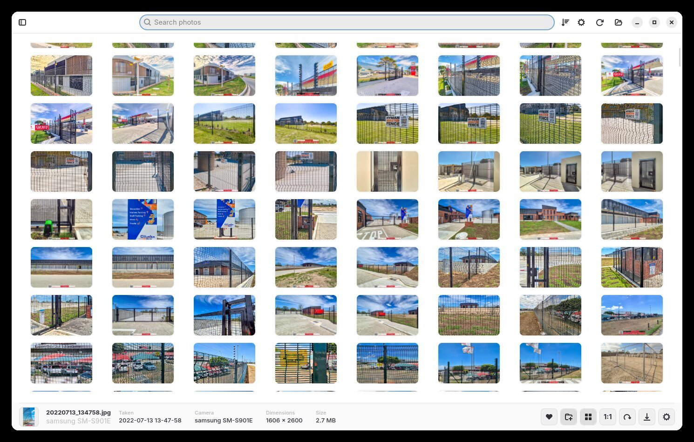

# PIC Guide 1 — Navigation: How the UI/UX Works

*Part of the [PIC release candidate guides](README.release.candidate.md).*

PIC is deliberately simple: **one window, three areas, zero learning curve**. This guide walks you through every part of the interface and how to move around.

---

## The Three Areas of the Window

Every time you open PIC you see the same friendly layout:

1. **The Sidebar (left)** — your map of everything: Library, Albums and Folders.
2. **The Top Bar** — search, sort and app controls.
3. **The Photo Grid (centre)** — your photos, plus the **Info Bar** at the bottom.

That's it. You can't get lost — there is only one window, and everything happens inside it.

---

## The Sidebar — Your Map

The sidebar is split into three sections:

- **Library** — *Photos* (your entire collection), *Favourites* (photos you've hearted) and *Recently Added*. Each shows a live count.
- **Albums** — your own collections. Create new ones with the **+** button.
- **Folders** — the real folders on your computer that PIC is watching, with photo counts and their disk locations.

Clicking anything in the sidebar instantly shows that collection in the grid. Clicking *Photos* brings back your whole library.

## The Top Bar — Search and Controls

Across the top you'll find:

- **Search photos** — type and results filter as you type.
- **Sort button** — order photos by date, name, size, dimensions or date added, ascending or descending.
- **Grouping** — group the grid by Day or Month, or keep it flat.
- **Refresh** — re-check your folders for new photos.
- **Settings** — themes, formats and app options.
- Window controls on the right, like any normal app.

## The Info Bar — Everything About the Selected Photo

Click any photo and the bar at the bottom comes alive:

- A small **thumbnail**, the **file name**, the **camera** it was taken with, the **date taken**, the **dimensions** and the **file size**.
- One-click **action buttons** on the right: ❤️ Favourite, ✏️ Edit, create Collage, thumbnail size, 1:1 view, Rotate, Export, Settings and Print.

No double-clicking required, no properties dialog — select a photo and the information is simply *there*.

---

## Getting Around — The Typical Flow

PIC's workflow is a simple circle:

**Grid → Single photo → Edit → back to the Grid**

1. **Scroll or search** to find what you're looking for in the grid.
2. **Click a photo** to select it (the info bar shows its details). 
3. **Click again (or press Enter / double-click)** to view it large.
4. **Move through photos** with the `←` / `→` arrow keys or the mouse wheel — you're flipping through the exact collection you came from.
5. **Press Edit** to fix a photo, then **Done** to come straight back where you were.

You never "leave" your library. Editing, viewing and organising all happen in the same window.

---

## Hide the Sidebar for Full-Photo Immersion

Want every pixel for your photos? Click the **sidebar toggle** in the top-left corner (or let it auto-hide) and the sidebar slides away, giving the photo grid the full width of the window. Click it again to bring the sidebar back.

This is great on smaller screens, or when you're just enjoying the pictures.

---

## Right-Click Anywhere

Right-clicking a photo — in the grid *or* in the large viewer — opens a compact menu with the actions you'd expect: open, favourite, add to album, edit, create a collage, export, print and more. It appears right where your mouse is and closes when you click elsewhere or press `Esc`.

---

## Keyboard & Mouse Summary

| Where | Action | How |
| --- | --- | --- |
| Grid | Move around | Arrow keys |
| Grid | Thumbnail size | Ctrl + mouse wheel |
| Grid | Select several photos | Ctrl + click |
| Grid / viewer | Photo menu | Right-click |
| Viewer | Next / previous | `←` / `→` or mouse wheel |
| Viewer | 1:1 / fit | `Space` (`1` = 100%, `0` = fit) |
| Viewer | Zoom | `+` / `-` or Ctrl + wheel |
| Viewer | Pan | Click and drag |
| Viewer | Close | `Esc` or double-click |
| Anywhere | Search | Just start typing in the search bar |

---

**Next guide:** [Folders — browsing your real folders →](README.folders.md)
